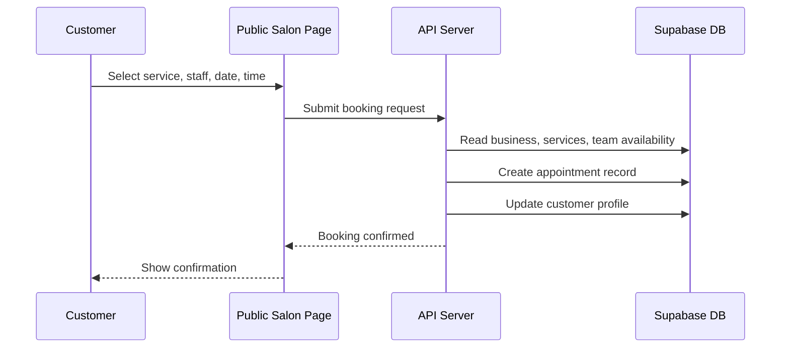
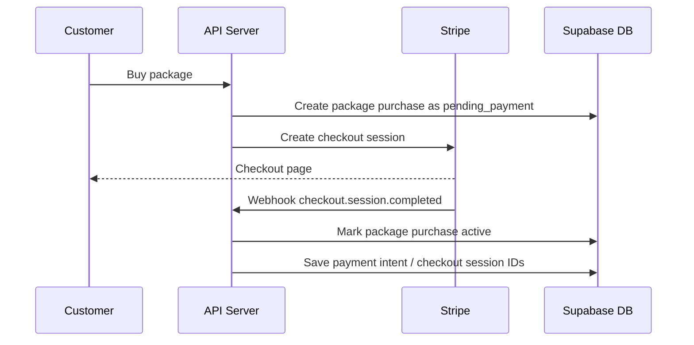

# BookMySalon Database Diagram

This document explains how the BookMySalon Supabase database is structured and how data moves through the system.

## High-Level Architecture

```mermaid
flowchart LR
  App[Web App / API Server] --> Storage{Storage Layer}
  Storage --> JsonTables[JSONB Sync Tables]
  Storage --> Mirror[Relational Mirror Layer]

  JsonTables --> ClientPayloads[client_platform_clients.payload]
  JsonTables --> AppointmentPayloads[appointment_records.payload]
  JsonTables --> PaymentPayloads[payment_records.payload]
  JsonTables --> PackagePayloads[package_purchase_records.payload]

  Mirror --> BusinessCore[Business Core Tables]
  Mirror --> BookingCore[Booking and Customer Tables]
  Mirror --> SalesCore[Payments, Packages, Products]
  Mirror --> BillingCore[Subscriptions and Invoices]

  Stripe[Stripe] --> Webhook[/api/stripe/webhook]
  Webhook --> BillingCore
  Webhook --> SalesCore

  Supabase[(Supabase PostgreSQL)] --> JsonTables
  Supabase --> Mirror
```

## Main Relationship Diagram

```mermaid
erDiagram
  businesses ||--o{ business_gallery_images : has
  businesses ||--|| business_settings : has
  businesses ||--o| business_stripe_connect_accounts : connects
  businesses ||--o{ business_service_types : offers
  businesses ||--o{ business_service_locations : supports
  businesses ||--o{ team_members : employs
  businesses ||--o{ services : offers
  businesses ||--o{ products : sells
  businesses ||--o{ product_sales : records
  businesses ||--o{ package_plans : defines
  businesses ||--o{ loyalty_programs : configures
  businesses ||--o{ customer_profiles : tracks
  businesses ||--o{ package_purchases : sells
  businesses ||--o{ loyalty_rewards : issues
  businesses ||--o{ appointments : receives
  businesses ||--o{ reviews : receives
  businesses ||--o{ payments : records
  businesses ||--o{ waitlist_entries : manages
  businesses ||--o{ business_subscription_records : subscribes
  businesses ||--o{ billing_invoice_records : billed_by

  services ||--o{ package_plan_services : included_in
  package_plans ||--o{ package_plan_services : includes
  package_plans ||--o{ package_purchases : purchased_as
  package_purchases ||--o{ package_purchase_services : includes
  services ||--o{ package_purchase_services : used_for

  loyalty_programs ||--o{ loyalty_program_services : applies_to
  services ||--o{ loyalty_program_services : eligible_for
  loyalty_rewards ||--o{ loyalty_reward_services : applies_to
  services ||--o{ loyalty_reward_services : discounted_by

  products ||--o{ product_sales : sold_as

  services ||--o{ appointments : booked_for
  team_members ||--o{ appointments : assigned_to
  package_purchases ||--o{ appointments : used_in
  loyalty_rewards ||--o{ appointments : redeemed_in

  appointments ||--o{ payments : paid_by
  appointments ||--o{ reviews : reviewed_by
  appointments ||--o{ waitlist_entries : claimed_from

  subscription_plan_records ||--o{ business_subscription_records : selected_as
  business_subscription_records ||--o{ billing_invoice_records : generates
```



## Core Tables

| Area | Tables | Purpose |
| --- | --- | --- |
| Business profile | `businesses`, `business_settings`, `business_gallery_images`, `business_service_types`, `business_service_locations` | Stores salon/business identity, settings, images, service categories, and service locations. |
| Stripe Connect | `business_stripe_connect_accounts` | Stores each business Stripe Connect account status, charges/payouts readiness, country, currency, and requirements. |
| Staff and services | `team_members`, `services` | Stores staff members and services that customers can book. |
| Booking | `appointments`, `waitlist_entries`, `customer_profiles` | Stores appointments, waitlist requests, and customer history per business. |
| Payments and reviews | `payments`, `reviews` | Stores appointment payments, refunds, and customer reviews. |
| Packages | `package_plans`, `package_plan_services`, `package_purchases`, `package_purchase_services` | Stores package plans, included services, customer purchases, Stripe checkout status, and remaining uses. |
| Loyalty | `loyalty_programs`, `loyalty_program_services`, `loyalty_rewards`, `loyalty_reward_services` | Stores loyalty settings and rewards earned or redeemed by customers. |
| Products | `products`, `product_sales` | Stores retail products and product sales. |
| Billing | `subscription_plan_records`, `business_subscription_records`, `billing_invoice_records` | Stores platform subscription plans, active business subscriptions, and invoices. |
| JSONB sync | `client_platform_clients`, `appointment_records`, `payment_records`, `review_records`, `package_purchase_records`, `loyalty_reward_records`, `waitlist_records`, `product_sale_records` | Stores full application payloads for compatibility and syncing. |

## Booking Flow



## Stripe Package Payment Flow



## Important Notes

- `businesses` is the main parent table. Most operational data belongs to one business through `business_id`.
- The app still stores full records in JSONB tables for compatibility, then mirrors important data into relational tables.
- `business_stripe_connect_accounts` does not store card data. It only stores Stripe account status and account ID.
- Stripe payment completion is confirmed through `/api/stripe/webhook`, not only from the browser redirect.
- `on delete cascade` is used for most child tables, so deleting a business removes its dependent records.
